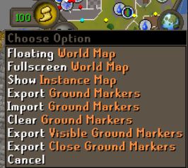

# Better Tile Exporter

Export only ground marker tiles which are within the camera view or within a configurable distance from the player.

Adds two optional world map menu items:

- `Visible Ground Markers`: only export markers which are within the camera viewpoint. You can move or zoom the camera to include/exclude markers.
- `Close Ground Markers`: only export markers which are within a configurable distance from the player. This distance can be set in the settings of the plugin.

